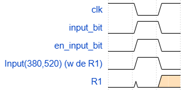
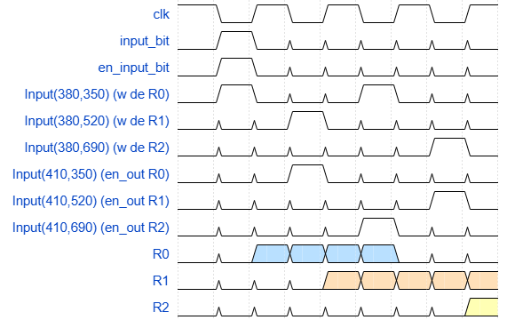

# Solución

## Secuenciales

1- **¿Cuáles son y qué representa cada entrada y cada salida del componente? ¿Cuáles entradas deben ser consideradas como de control?**  
- `clk`: clock;
- `Reg_in`: entrada del registro (input);
- `w`: habilita la escritura (write);
- `en_out`: habilita la salida (output);
- `Reg_Debug`: flag que vale 1 si hubo una salida del flip-flop; en caso contrario, vale 0;
- `Reg_output`: flag que indica si hay salida del registro. Puede tomar los valores 0, 1 o U (indeterminado), según `en_out`.

Las entradas que se consideran de control son `w` y `en_out`, ya que ambas condicionan la salida de los flags `Reg_Debug` y `Reg_output`.

2- 

	

Imagen 1. Secuencia de activación y desactivación de entradas para que el registro R1 pase a tener el valor 1.

3-

	

Imagen 2. Secuencia de activación que inicialmente tiene un valor 1 en R0, luego este valor se transfiere a R1, luego de R2 a R0, y finalmente de R1 a R2.

## OrgaSmall

### Análisis  
1- **¿Cuál es el tamaño de la memoria?**  
El tamaño de la memoria se puede calcular a partir de la cantidad de bits por entrada y la cantidad de filas que contiene. En este caso, hay dos entradas de 8 bits cada una (`addr` e `inData`), lo que da un total de 16 bits por fila. Como la memoria tiene 4 filas, el tamaño total es de $`16 \cdot 4 = 64`$ bits.

2- **¿Qué tamaño tiene el PC?**  
Gracias a la entrada `inValue` conocemos que el PC tiene un tamaño de 8 bits.

3- **Observando el formato de instrucción y los CodOp de la hoja de datos: ¿Cuántas instrucciones nuevas se podrían agregar respetando el formato de instrucción indicado?**  
El formato de instruccion dado es de 5 bits, por lo que la cantidad máxima seria $`2^5 = 32`$. Viendo que contamos con 22 instrucciones ya definidas en la estructura de la memoria de micro-instrucciones se podrían definir 10 más.

4- 
**Contador de Programa: ¿Qué función cumple la señal inc?**  
El incrementador (`inc`) cumple la función de sumar un bit al `inValue` actualizando el contador del programa (`PC`).

**ALU (Unidad Aritmético Lógica): ¿Qué función cumple la señal opW?**  
Es una señal de control que habilita la escritura en un registro, permitiendo almacenar el resultado de la operación realizada por la ALU.

**microOrgaSmall (DataPath): ¿Para qué sirve la señal DE_enOutImm? ¿Qué parte del circuito indica que registro se va a leer y escribir?**  
Permite la salida inmediata del decode al bus de datos. La parte del circuito que indica qué registro se va a leer y escribir es la control unit, más específicamente los túneles `RB_selectIndexIn` y `RB_selectIndexOut` ya que manejan los selectores de un multiplexor. 

**ControlUnit (Unidad de control): ¿Cómo se resuelven los saltos condicionales? Describir el mecanismo.**  
En el circuito logico visualizamos tres túneles: `jc_microOp`, encargado del salto por carry; `jz_microOp`, encargado del salto por zero; `jn_microOp`, encargado del salto por negative. Al tener la entrada `flags` conocemos si se cumple alguna de las 3 condiciones (carry, zero o negative), si se cumple alguna de estas y algun `jump` fue invocado se activa el multiplexor encargado de determinar si se hace el salto condicional o no. Luego, gracias al segundo multiplexor, se realiza la operación pasada por `inOpcode`, si es que no se realizó el salto; en caso contrario se altera esta dirección y se devuelve al `microPC`.

## Ensamblar y correr

1- **Antes de correr el programa, identificar el comportamiento esperado.**  
Se busca hacer una suma entre dos registros. La seccion `siguiente` contempla el caso de carry, si este se efectua, se ejecuta nuevamente la sección `siguiente`, conservando los bits menos significativos en `R0`. Finalmente se realiza la suma, alcanzando la seccion `halt` que finaliza la ejecución.

2- **¿Qué lugar ocupará cada instrucción en la memoria? Detallar por qué valor se reemplazarán las etiquetas.**  
Instrucciones:  
-  `SET`: Es formato D siendo `11111 000 1111 1111` para `SET R0, 0xFF` (`R0 = 000`) y para `SET R1, 0x11` (`R1 = 001`) `11111 001 0001 0001`.  
- `ADD`: Es formato A, con la codificación `00001 R0 R1 00000`, donde `R0` y `R1` son tres bits que codifican el número de registro.  
- `JC`: Es formato C siendo `10101 000 MMMMMMMM` donde `MMMMMMMM` es la direccion de memoria de `siguiente`.  
- `JMP`: Es formato C `10100 000 MMMMMMMM` donde `MMMMMMMM` es la direccion de memoria de `seguir` o `halt`.  

`R0` inicialmente toma el valor `1111 1111` y `R1` el valor `0001 0001`, pero al momento de realizar la suma se produce un carry, ya que el resultado es `0x110`. Como los registros son de 8 bits, solo se guarda el LSB, es decir, `0001 0000` `(0x10)` en `R0`, y el MSB activa el flag de carry. Esto permite que la instrucción `JC` salte nuevamente a `siguiente` y repita la suma con los nuevos valores.

3- **Ejecutar y controlar ¿cuántos ciclos de clock son necesarios para que este código llegue a la instrucción JMP halt?**  
Para que el código llegue a la instrucción `JMP halt`, se necesitan 20 ciclos de clock, ya que por cada microinstrucción de las instrucciones anteriores al salto es necesario un ciclo de clock.

4- **¿Cuántas microinstrucciones son necesarias para realizar el ADD? ¿Cuántas para el salto?**  
Para realizar el `ADD`, se necesitan realizar 11 microinstrucciones en total, siendo: 2 por el primer `JMP`, 2 por cada `SET` y 5 por el `ADD`. Para ejecutar el `JC`, se necesitan 15 microinstrucciones en total.

## Ampliando la máquina

Implementación en el archivo `ampliando.ops` y su código de ejemplo en `ejemplo.asm`.